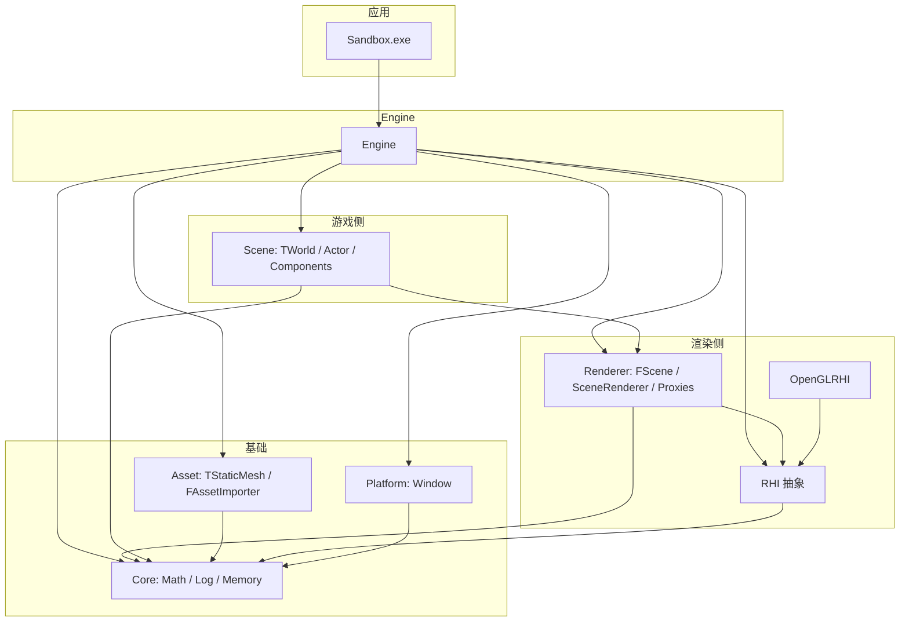

# ToyEngine 架构与模块说明

**极简路径索引**（一页表）：[INDEX.md](./INDEX.md)

本文档面向 **AI 辅助编码** 与人工阅读，概括仓库 `Source/` 下的模块划分、依赖关系、数据流与主要公开接口。第三方库见仓库根目录 `ThirdParty/`，本文不展开。

**命名空间**：引擎代码均在 `namespace TE`。

**命名惯例（与 UE 风格对齐）**：

- `T` 前缀：游戏侧可实例化类型（如 `TActor`、`TWorld`）。
- `F` 前缀：多为结构体或渲染侧数据（如 `FScene`、`FViewInfo`、`FMeshDrawCommand`）。

---

## 1. 项目概览

ToyEngine 是一个 **C++20** 教学/玩具引擎，CMake 工程。当前渲染后端以 **OpenGL** 为主（`TE_RHI_OPENGL`），RHI 抽象层预留 Vulkan/D3D12 接入点。

**核心设计**：借鉴 **UE5 的单线程 Game/Render 数据分离**——`TWorld` + 组件体系负责逻辑；`FScene` + `FPrimitiveSceneProxy` 持有渲染镜像；`SceneRenderer` 收集 `FMeshDrawCommand` 并经 `RHICommandBuffer` 提交。

**入口应用**：`Source/Sandbox/Main.cpp` 使用 `Engine` 单例：`Init()` → `Run()` → `Shutdown()`。

---

## 2. 源码目录与 CMake 模块

| 路径 | CMake 目标（典型） | 职责摘要 |
|------|-------------------|----------|
| `Source/Runtime/Core` | `Core` | 数学、日志、内存（TLSF）、通用工具 |
| `Source/Runtime/Platform` | `Platform` | 窗口抽象（GLFW 实现） |
| `Source/Runtime/OpenGLRHI` | `OpenGLRHI` | OpenGL 版 `RHIDevice` / 命令缓冲等 |
| `Source/Runtime/RHI` | `RHI` | 图形 API 无关的 RHI 接口与类型 |
| `Source/Runtime/Asset` | `Asset` | 静态网格资产 `TStaticMesh`、Assimp 导入 |
| `Source/Runtime/Scene` | `Scene` | Actor/Component/World（游戏侧） |
| `Source/Runtime/Renderer` | `Renderer` | `FScene`、SceneProxy、场景渲染器 |
| `Source/Runtime/Engine` | `Engine` | 引擎单例、初始化顺序、主循环 `Tick` |
| `Source/Sandbox` | 可执行文件 | 示例启动 |

`Source/Runtime/CMakeLists.txt` 中注释标明：**先编译 RHI 后端实现，再编译 RHI 抽象层**；Vulkan/D3D12 子目录当前为注释占位。

---

## 3. 模块依赖（高层）

**要点**：`FScene` 不拥有 `FPrimitiveSceneProxy` 的内存；Proxy 由 `TPrimitiveComponent` 创建与销毁，`FScene` 只存裸指针列表。

---

## 4. 每帧数据流（单线程）

与 `Engine.h` / `Engine.cpp` 注释一致：

1. `Engine::Tick(deltaTime)`
2. `Window::PollEvents()`
3. `TWorld::Tick` — 更新 Actor/组件逻辑
4. `TWorld::SyncToScene(FScene*)` — 将脏 `TPrimitiveComponent` 的世界矩阵同步到对应 `FPrimitiveSceneProxy`
5. `TCameraComponent::BuildViewInfo()` — 写入 `FScene::SetViewInfo`
6. `SceneRenderer::Render(FScene*, RHIDevice*, RHICommandBuffer*)` — 收集并排序绘制命令，提交 RHI
7. `Window::SwapBuffers()`

---

## 5. 各模块与主要类型

### 5.1 Core（`Source/Runtime/Core`）

**职责**：数学类型、变换、视锥/几何工具、日志、TLSF 内存、（可选）随机数等。

| 头文件 / 类型 | 作用 |
|---------------|------|
| `Math/MathTypes.h` | `Vector2/3/4`、`Matrix3/4`、`Quat` 等；内部基于 **glm**，提供引擎层 API |
| `Math/Transform.h` | `Transform`：位置、四元数旋转、缩放；`ToMatrix()`、LookAt、插值等 |
| `Math/MathUtils.h`、`Geometry.h`、`Frustum.h`、`Color.h`、`VectorInt.h` | 通用数学与几何、视锥剔除等 |
| `Log/Log.h` | `Log::Init()`；宏 `TE_LOG_INFO` 等（spdlog） |
| `Memory/Memory.h` | `MemoryInit` / `MemoryShutdown`；`MemAlloc` / `MemFree`；`GetMemoryStats` |
| `Memory/MemoryTag.h` | `MemoryTag` 枚举（Core、RHI、Scene 等分类统计） |
| `Memory/MemoryNew.h` | `TE::New` / `TE::Delete` / `MakeUnique` — 在 TLSF 上构造对象 |

---

### 5.2 Platform（`Source/Runtime/Platform`）

**职责**：跨平台窗口与事件；OpenGL 上下文由具体实现创建（如 GLFW）。

| 类型 | 主要接口 |
|------|----------|
| `WindowConfig` | `title`、`width`、`height`、`resizable` |
| `Window`（抽象） | `Create(config)` 工厂；`PollEvents`、`ShouldClose`、`GetWidth`/`GetHeight`、`GetFramebufferWidth`/`GetFramebufferHeight`、`SetResizeCallback`、`SetKeyCallback`、`SwapBuffers`、`SetVSync` / `IsVSyncEnabled`、`GetNativeHandle` |

---

### 5.3 RHI（`Source/Runtime/RHI/Public`）

**职责**：与图形 API 无关的资源与录制接口。统一入口：`RHI.h`（包含 `RHITypes`、`RHIBuffer`、`RHIShader`、`RHIPipeline`、`RHICommandBuffer`、`RHIDevice`）。

| 类型 | 作用 |
|------|------|
| `RHITypes.h` | 枚举：`RHIShaderStage`、`RHIBufferUsage`、`RHIFormat`、`RHIPrimitiveTopology` 等；结构体：`RHIBufferDesc`、`RHIShaderDesc`、`RHIPipelineDesc`、`RHIVertexInputDesc`、`RHIRenderPassBeginInfo`、`RHIViewport`、`RHIScissorRect` 等 |
| `RHIDevice` | 纯虚接口：`CreateBuffer`、`CreateShader`、`CreatePipeline`、`CreateCommandBuffer`；静态 `Create()` 按编译选项选后端 |
| `RHICommandBuffer` | `Begin` / `BeginRenderPass` / `BindPipeline` / `BindVertexBuffer` / `BindIndexBuffer` / `SetViewport` / `SetScissor` / `Draw` / `DrawIndexed` / `SetUniformMatrix4` 等（name-based uniform，面向 OpenGL；Vulkan 将来可换 descriptor） / `EndRenderPass` / `End` |
| `RHIBuffer` | `GetSize`、`GetUsage` |
| `RHIShader` | `GetStage`、`IsValid` |
| `RHIPipeline` | `IsValid` |

---

### 5.4 OpenGLRHI（`Source/Runtime/OpenGLRHI`）

**职责**：`OpenGLDevice` 实现 `RHIDevice`；内部类实现 `RHICommandBuffer`、`RHIBuffer`、`RHIShader`、`RHIPipeline`（头文件多在 `Private/`）。

---

### 5.5 Asset（`Source/Runtime/Asset`）

**职责**：CPU 侧网格资产与文件导入。

| 类型 | 作用 |
|------|------|
| `FStaticMeshVertex` | 位置、法线、UV、顶点色 |
| `FMeshSection` | 单段顶点/索引、`MaterialIndex`（预留） |
| `TStaticMesh` | 多 `FMeshSection`；`GetSections`、`IsValid`、`AddSection`、`SetName` 等 |
| `FAssetImporter` | 静态方法 `ImportStaticMesh(filePath)` → `std::shared_ptr<TStaticMesh>`；内部 **Assimp**，头文件不泄漏到其他模块 |

---

### 5.6 Scene（`Source/Runtime/Scene/Public`）

**职责**：游戏世界与组件层次。

| 类型 | 作用 |
|------|------|
| `TComponent` | 基类：`Tick`、`Owner`、`Name` |
| `TSceneComponent` | 继承 `TComponent`；`Transform`；`GetWorldMatrix()` |
| `TPrimitiveComponent` | 继承 `TSceneComponent`；`CreateSceneProxy(RHIDevice*)`、`MarkRenderStateDirty`、`RegisterToScene` / `UnregisterFromScene`；持有 `FPrimitiveSceneProxy*` |
| `TMeshComponent` | 继承 `TPrimitiveComponent`；`shared_ptr<TStaticMesh>`；`CreateSceneProxy` 创建 `FStaticMeshSceneProxy` |
| `TCameraComponent` | 继承 `TSceneComponent`；FOV、宽高比、近远面；`BuildViewInfo()` → `FViewInfo` |
| `TActor` | 组件列表；`AddComponent<T>`；首个 `TSceneComponent` 为 `RootComponent`；`GetTransform` |
| `TWorld` | `AddActor` / `SpawnActor<T>`；`Tick`；`SyncToScene`；`RegisterPrimitiveComponent`；`SetScene` / `SetRHIDevice` |

---

### 5.7 Renderer（`Source/Runtime/Renderer/Public`）

**职责**：渲染侧场景与调度。

| 类型 | 作用 |
|------|------|
| `FViewInfo` | `ViewMatrix`、`ProjectionMatrix`、`ViewProjectionMatrix`、视口尺寸；`UpdateViewProjectionMatrix()` |
| `FScene` | `AddPrimitive` / `RemovePrimitive`；`GetPrimitives`；`SetViewInfo` / `GetViewInfo` |
| `FMeshDrawCommand` | `Pipeline`、`VertexBuffer`、`IndexBuffer`、`IndexCount`、`WorldMatrix` |
| `FPrimitiveSceneProxy` | 基类：`SetWorldMatrix` / `GetWorldMatrix`；纯虚 `GetMeshDrawCommands` |
| `FSectionGPUData` | 每段 VBO/IBO 与 `IndexCount` |
| `FStaticMeshSceneProxy` | 从 `TStaticMesh` + `RHIDevice` 构建 GPU 数据；`GetMeshDrawCommands`；`IsValid` |
| `SceneRenderer` | `Render(FScene*, RHIDevice*, RHICommandBuffer*)`；上一帧 `GetLastDrawCallCount` 等统计 |

---

### 5.8 Engine（`Source/Runtime/Engine`）

**职责**：进程级单例，串联子系统。

| `Engine` 公开方法（摘要） | 说明 |
|---------------------------|------|
| `Get()` | 单例引用 |
| `Init()` / `Run()` / `Shutdown()` | 生命周期 |
| `RequestExit()` / `IsRunning()` | 主循环控制 |
| `GetWindow()` / `GetRHIDevice()` | 子系统访问 |
| `GetDeltaTime()` / `GetTotalTime()` / `GetFrameCount()` | 时间与帧计数 |

内部持有：`Window`、`RHIDevice`、`RHICommandBuffer`、`TWorld`、`FScene`、`SceneRenderer`、相机与已加载网格等（见 `Engine.h`）。

---

### 5.9 Sandbox & Tests

- **Sandbox**：仅包含 `main`，调用 `Engine::Get()` 的 `Init` / `Run` / `Shutdown`。
- **Tests**：`Tests/CMakeLists.txt` 将 `Tests/*.cpp` 各编为可执行文件并 **link `Core`**，用于单元测试式程序，不默认依赖完整 Engine/RHI。

---

## 6. 扩展与注意事项（给 AI）

1. **新 RHI 后端**：实现 `RHIDevice` 及各类 RHI 接口的具体类；在 `RHIDevice::Create()` 与 `CMake` 中接入；保持 `RHICommandBuffer` 语义与现有 `SceneRenderer` 一致。
2. **新可渲染物体**：通常新增 `TPrimitiveComponent` 子类 + `FPrimitiveSceneProxy` 子类，在 `CreateSceneProxy` 中返回，并实现 `GetMeshDrawCommands`。
3. **资产**：新格式导入应放在 `FAssetImporter` 或新 Importer，对外仍尽量只暴露 `TStaticMesh` 等引擎类型。
4. **用户规则**：若编写 Vulkan 相关代码，项目约定使用 **Vulkan-HPP 风格**、**RAII**，且对 `CreateInfo` 成员补充注释说明用途（见用户规则）。

---

## 7. 关键文件速查（路径）

| 用途 | 路径 |
|------|------|
| 引擎主类 | `Source/Runtime/Engine/Public/Engine.h` |
| RHI 聚合 | `Source/Runtime/RHI/Public/RHI.h` |
| 世界与同步 | `Source/Runtime/Scene/Public/World.h` |
| 渲染调度 | `Source/Runtime/Renderer/Public/SceneRenderer.h` |
| 静态网格资产 | `Source/Runtime/Asset/Public/TStaticMesh.h` |
| 构建选项 | `CMake/EngineOptions.cmake`（如 `TE_RHI_OPENGL`） |

---

*文档版本对应仓库结构；若 CMake 或类接口变更，请同步更新本节。*
