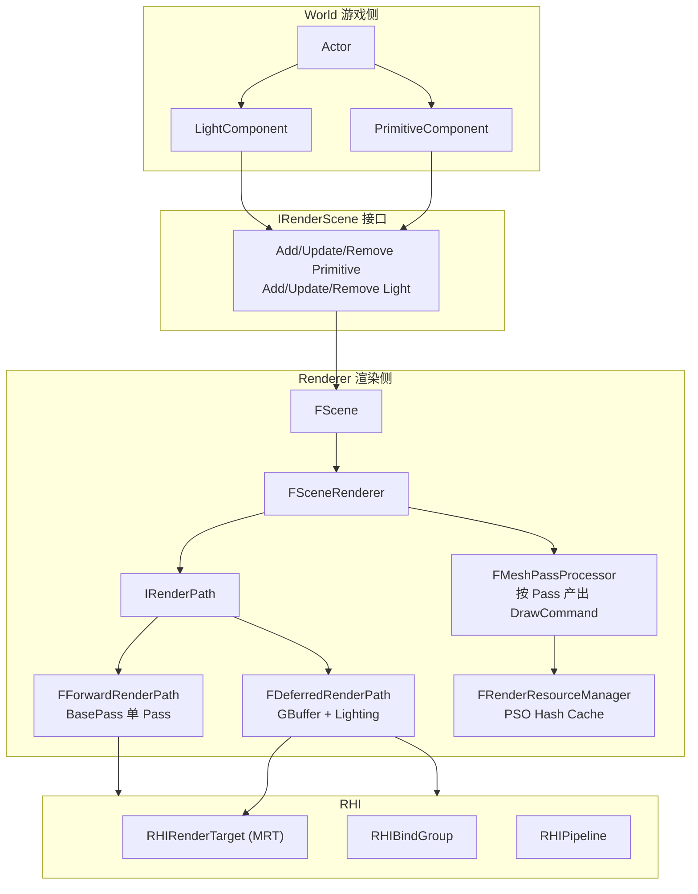

# 架构优化复盘：前向与延迟双渲染路径

> 本文档按 `AGENTS.md` 要求，对"结构性/架构性修改"采用**增量记录**方式维护。每个阶段落地后，都必须在文档末尾追加记录，不覆盖旧内容，保留完整的决策演进。
>
> 文档目标读者：后续维护 ToyEngine 渲染层的开发者。阅读完本文后应能回答：
> - 为什么要同时搭前向和延迟两条渲染路径？两者在工程上各自代价是什么？
> - 为什么选择 `IRenderPath` + `FMeshPassProcessor` + 结构化 `FPipelineKey` 这一组抽象，而不是更简单的 if/else 或继承某个 SceneRenderer？
> - GBuffer 的格式、精度、Y 翻转、sRGB、Load/Store、屏障，这些在多 API 后端下是如何保证一致的？
> - 某一阶段改动了什么，收益是什么，还剩哪些已知限制？

---

## 1. 背景

当前 ToyEngine 的渲染层已按 UE5 思路做了一轮基础拆分：`FPrimitiveSceneProxy` / `FMeshDrawCommand` / `FScene` / `FSceneRenderer` / `FRenderResourceManager`。但离真正支持"多 Pass、多光源、多材质域"的现代渲染路径还有几道结构性断层：

1. ~~**渲染循环是单一 BasePass 扁平流程**。~~（已在 Stage 5 修正）[`FSceneRenderer::Render`](../../Source/Runtime/Renderer/Private/SceneRenderer.cpp) 现只调度当前 `IRenderPath`；`FForwardRenderPath` 与 `FDeferredRenderPath` 均已落地，默认从 Forward 启动，并可在运行时切换。
2. ~~**PipelineKey 是单值枚举**。~~（已在 Stage 1 修正）[`FMeshDrawCommand`](../../Source/Runtime/RenderCore/Public/MeshDrawCommand.h) 现持有 `FPipelineKey(Pass, MaterialDomain, VertexFactory)`，但当前真实可解析的组合仍只有 `StaticMeshBasePass`。
3. ~~**PSO 不是缓存，是单例**。~~（已在 Stage 1 修正）[`FRenderResourceManager`](../../Source/Runtime/Renderer/Private/RenderResourceManager.cpp) 现使用 `unordered_map<FPipelineKey, FPreparedPipeline, FPipelineKeyHash>` 管理 Pipeline 与 shader 生命周期；后续 Stage 2/4 仍需补充更多 key 到 shader 描述的映射。
4. ~~**RHI 已预留 RT 基础设施但 OpenGL 不支持**。~~（已在 Stage 0/4 修正）OpenGL 后端已支持 `RHIRenderTarget`，Stage 4 已用它承载 Deferred GBuffer MRT。
5. ~~**场景不管理光源**。~~（已在 Stage 3 修正）`World` 已新增 `LightComponent` / `DirectionalLightComponent` / `PointLightComponent`，`FScene` 已维护 `FLightSceneProxy` 列表，Forward BasePass 不再使用硬编码 `u_LightDir` / `u_LightColor`。
6. **提交路径仍是 name-based uniform**。`SetUniformMatrix4("u_MVP", …)` / `BindTexture2D(0, tex)` 是 OpenGL 过渡接口；Stage 3 的光源数组也暂时沿用该接口逐项写入，后续仍需迁移到 BindGroup / UBO，才能更好适配 Vulkan / D3D12。

这些问题并不是彼此孤立的——它们构成一条阻碍现代渲染路径落地的完整断层。**只补 RT 不补 Pass 抽象**，上层仍无法调度多 Pass；**只补 Pass 抽象不补 PSO 缓存**，每个 Pass 都要单独写 `unique_ptr<RHIPipeline>` 字段；**只补 PSO 缓存不补光源体系**，Deferred 的 Lighting Pass 没东西可算。因此这次改造必须按阶段把整条链路一起打通。

## 2. 目标与非目标

### 2.1 目标

在现有分层基础上引入 UE5 风格的 `IRenderPath` + `FMeshPassProcessor` + `FLightSceneProxy`，并补齐 OpenGL 后端的 FBO 能力，落地两条可运行时切换的**最小可用**渲染路径：

- **Forward Path**：单 BasePass，片段内对方向光 + 点光做 Blinn-Phong 循环累加。
- **Deferred Path**：`GBuffer Pass`（MRT：Albedo + WorldNormal + Depth）→ `Lighting Pass`（全屏三角形，采样 GBuffer，累加多光源）。

**切换入口**：`Engine::SetRenderPath(ERenderPathType)`，Sandbox 绑定 F1 / F2 做现场对比。

### 2.2 非目标（最小版不做）

| 方向 | 说明 |
| --- | --- |
| PBR / IBL | 仅 Blinn-Phong，不做 Cook-Torrance、不做环境光探针、不做 prefiltered env map |
| 阴影 | 不做 Shadow Map / PCF / CSM |
| 后处理 | 不做 Tonemapping / Bloom / SSAO / FXAA |
| 可见性裁剪 | 不做 Frustum / Occlusion culling，遍历整个 `m_Primitives` |
| 渲染线程 | 仍在 GameThread 直接提交，`IRenderScene` 不做命令队列化 |
| SPIR-V 管线 | OpenGL 后端继续使用 GLSL 文本；Vulkan / D3D12 后端暂不接入 |
| 材质系统 | 仅支持 BaseColor 贴图；不做材质参数 block、不做 shader permutation |
| Tile / Clustered 光照 | Forward 用固定数组循环；Deferred 用简单全屏遍历 |

这些都**明确标记为"计划中"**，不在本次改造的 5 个阶段里落地。

## 3. 渲染路径基础原理（设计依据）

为了让后续维护者看到 `IRenderPath` / `GBuffer` / `LightingPass` 这些名字时理解背后的理由，这里把前向与延迟的渲染方程、复杂度、典型问题一并沉淀下来。

### 3.1 Forward 渲染

**基本流程**：

```
for each object in visible_objects:
    bind(object.material.pipeline)
    for each pixel covered by object:
        color = evaluate_material(object, pixel)
        for each light in lights_affecting_pixel:
            color += shade(object, light, pixel)
        framebuffer[pixel] = color
```

**渲染方程实际形态**（单片段）：

```
L_out(p, ω_o) = L_emit + Σ_i  f_r(p, ω_i, ω_o) · L_i(p) · max(n·ω_i, 0)
```

每个片段对所有光源求和，材质 BRDF `f_r` 每个光源都要算一次。

**复杂度**：`O(visible_pixels × lights_per_pixel × BRDF_cost)`。

**优点**：

- **半透明天然支持**：透明物体按深度排序后走 alpha blend，与不透明共用一条 Pass。
- **MSAA 原生友好**：着色在片段阶段完成，采样率 = 深度采样率 = 着色采样率。
- **材质多样性低成本**：不同材质 / 着色模型 / 自定义光照计算之间没有"统一 GBuffer 编码"的约束。
- **带宽友好**：一次 BasePass 写一张 color target，没有 MRT。

**瓶颈**：

- **Overdraw 放大光照成本**：一个像素被覆盖 N 次就要算 N × L 次光照。
- **光源数量难扩展**：固定数组循环到几十就已经接近带宽与 ALU 上限。
- **Depth Pre-Pass 几乎必需**：工业实现几乎都会先做 Z Prepass 消除着色 overdraw，再做真正的 BasePass with `glDepthFunc(EQUAL)`。

### 3.2 Deferred 渲染

**基本流程**：

```
# Pass 1: GBuffer
for each object in visible_objects:
    bind(object.material.gbuffer_pipeline)
    for each pixel covered by object:
        gbuffer[pixel] = encode(material_params, normal, depth, ...)

# Pass 2: Lighting
for each pixel on screen:
    params = decode(gbuffer[pixel])
    color = 0
    for each light in lights:
        color += shade(params, light)
    framebuffer[pixel] = color
```

**关键：把"材质求值"和"光照累加"解耦**。GBuffer 记录"这个像素是什么材质、什么朝向、什么位置"；Lighting Pass 不再关心几何，只负责对每个屏幕像素累加所有光源。

**复杂度**：`O(visible_pixels × BRDF_params_encoding) + O(screen_pixels × lights × BRDF_light_term)`。与 Forward 相比，光照 × 几何的乘积被拆成加法关系——多光源几乎线性代价，overdraw 不影响光照。

**优点**：

- **多光源廉价**：几十到几百个小点光源可以轻松接受，Clustered Deferred 甚至能到上千。
- **光照与材质解耦**：增加一个光源只是 Lighting Pass 里多一次循环，不需要重编 shader。
- **BasePass 着色更统一**：GBuffer 编码规则一旦定死，各种材质都走同一套 encode/decode。

**瓶颈**：

- **半透明走不通**：透明像素没办法写 GBuffer（只有一层深度 / 法线）。工业实现始终保留一条 Forward Translucent 路径。
- **MSAA 代价大**：GBuffer 要么走 SampleSelection + per-sample shading（带宽爆炸），要么退化为 MLAA/FXAA/TAA。
- **带宽压力**：GBuffer 是多张全屏 target；在移动端和集成显卡上是致命瓶颈。
- **材质灵活度下降**：GBuffer 通道数有限，自定义着色模型只能塞进预留通道或 Shading Model ID。

### 3.3 现代演进（作为选型坐标）

| 变体 | 核心思想 | 适用点 |
| --- | --- | --- |
| Z Prepass + Forward | 先只写深度再 BasePass `DEPTH_EQUAL`，消除着色 overdraw | 移动端、不透明为主场景 |
| Forward+ (Tiled Forward) | 屏幕分 16×16 tile，CS 生成每 tile 的光源列表；片段只取相关光源 | 半透明 + 多光源兼顾 |
| Classic Deferred | GBuffer → Lighting 全屏 Pass | 本项目最小版 |
| Clustered Deferred | 视锥分 3D 集群（xy tile × z slice），CS 生成每 cluster 光源列表 | UE5 当前主路径 |
| Tiled Deferred | 屏幕分 tile，CS 做一 pass 遍历 | 移动端 Deferred |
| Visibility Buffer | 只写 primitive id / bary，光照时 material fetch + shade | 超几何密度场景，GPU-driven |

ToyEngine 本次改造落地的是 **Classic Forward + Classic Deferred** 两个最小版本，但抽象层（`IRenderPath`、`FMeshPassProcessor`、结构化 `FPipelineKey`）有意识地为后续向 Forward+ / Clustered Deferred 演进留好扩展点：

- Forward+ 需要新增一个 ComputePass 算 tile lightlist，对 `IRenderPath` 只是多一个 Pass 节点。
- Clustered Deferred 的 cluster buffer 是新的 UBO/SSBO，对 `FLightSceneProxy` 是透明的（光源数据不变，只是加了一层索引）。

### 3.4 Forward / Deferred 取舍矩阵

| 维度 | Forward 优 | Deferred 优 |
| --- | --- | --- |
| 光源数量 | ~10 | ~100+ |
| 半透明 | 原生 | 必须退化到 Forward 子路径 |
| MSAA | 原生 | 受限 / 成本大 |
| 材质多样性 | 任意自定义 BRDF | 受 GBuffer 通道限制 |
| 带宽 | 单 color + depth | MRT + 全屏读写 |
| Overdraw 代价 | 放大 | 只影响 GBuffer Pass |
| 实现复杂度 | 低 | 中（GBuffer 设计 + 两 Pass 协调） |
| Decal / SSR / SSAO | 受限 | 自然支持（读深度/法线） |

**本项目同时保留两者的动机**：一是学习场景需要两者可直接对比；二是未来接入半透明 / 后处理时，这两条路径天然各司其职——不透明走 Deferred，半透明走 Forward Translucent 子路径，这是 UE5 现行的实际组合。

## 4. 本次改造对齐的 UE5 设计

虽然 ToyEngine 不会照搬 UE5 全部机制，但在抽象分层上有意识地对齐，保证后续阅读 UE5 源码时能形成映射。

### 4.1 Mesh Draw Pipeline（`FMeshPassProcessor`）

UE5 每个 Pass（DepthPass / BasePass / ShadowDepth / Translucency / …）都有一个对应的 `FMeshPassProcessor` 子类，职责是：

1. 接收 `FMeshBatch`（由 `SceneProxy::GetDynamicMeshElements` 或静态缓存产出）。
2. 根据 Pass 类型 + 材质 + VertexFactory 查询 `FShader` 与 `FGraphicsPipelineState`。
3. 产出 `FMeshDrawCommand`，按 PSO / Shader Binding / Mesh Id 做 state sort。
4. 送入 `FParallelMeshDrawCommandPass` 并行提交。

ToyEngine 对应实现（Stage 2 落地）是一个最简版 `FMeshPassProcessor`：输入 `FScene* + EMeshPassType`，输出 `vector<FMeshDrawCommand>`。暂不做并行，但调用签名保持可扩展到并行 worker。

### 4.2 RenderPath / SceneRenderer 拓扑

UE5 的 `FSceneRenderer` 是一个基类，具体子类 `FDeferredShadingSceneRenderer` / `FMobileSceneRenderer` 分别实现 Desktop Deferred 和 Mobile Forward。每个子类的 `Render()` 里是一串 Pass 调用（`RenderPrePass` → `RenderBasePass` → `RenderLights` → `RenderTranslucency` → `RenderPostProcessing`）。

ToyEngine 对应（Stage 2 落地）用**策略模式**简化：`FSceneRenderer` 只做调度，不再持有 Pass 顺序；`IRenderPath` 的子类 `FForwardRenderPath` / `FDeferredRenderPath` 封装 Pass 顺序。好处是切换路径只替换一个策略对象，不需要动 `FSceneRenderer`。

### 4.3 Light / Primitive Proxy 分离

UE5 的 `FPrimitiveSceneProxy` 和 `FLightSceneProxy` 是对等的两类 Scene 对象，都是渲染线程私有的镜像。Primitive 负责几何提交，Light 负责光照参数。

ToyEngine 在 Stage 3 落地对应的：

- `FLightSceneProxy`：`ELightType { Directional, Point }`、方向/位置/颜色/强度/半径。
- `LightComponent` / `DirectionalLightComponent` / `PointLightComponent`，对齐 `PrimitiveComponent` 的脏标记与 `RegisterToRenderScene`。
- `IRenderScene` 扩展 `AddLight / UpdateLight / RemoveLight`，语义与 Primitive 三联完全对称。

### 4.4 UE5 → ToyEngine 名称映射

| UE5 | ToyEngine | 说明 |
| --- | --- | --- |
| `FScene` | `FScene` | 同名 |
| `FPrimitiveSceneProxy` | `FPrimitiveSceneProxy` | 同名 |
| `FLightSceneProxy` | `FLightSceneProxy` | Stage 3 已落地 |
| `FMeshBatch` | 暂无显式类型，`FPrimitiveSceneProxy::GetMeshDrawCommands` 直接产 DrawCommand | Stage 2 若需要再引入 |
| `FMeshDrawCommand` | `FMeshDrawCommand` | 字段较少 |
| `FMeshPassProcessor` | `FMeshPassProcessor` | Stage 2 已落地最小 BasePass 版本 |
| `FGraphicsPipelineStateInitializer` | `RHIPipelineDesc` | RHI 层已具备 |
| `FSceneRenderer` / `FDeferredShadingSceneRenderer` | `FSceneRenderer` + `IRenderPath` | 用策略模式替代继承 |
| `InitViews` | **未实现** | 计划中：可见性裁剪 |
| `FRHICommandList` | `RHICommandBuffer` | OpenGL 是 immediate |
| Render Dependency Graph (RDG) | 无 | 远期；当前用手写 Pass 顺序 |

明确：**本次改造不引入 RDG**。RDG 的收益在于 Pass 间资源依赖自动管理，但最小版 Pass 数量少、依赖关系写死在 `IRenderPath` 里就够清晰。

## 5. 总体架构蓝图



**切换入口**：`Engine` 持有 `ERenderPathType m_RenderPath`，通过 `SetRenderPath()` 调用 `FSceneRenderer::SetRenderPath(type, device)`，内部构造新的 `IRenderPath` 替换旧的。资源生命周期由 `IRenderPath` 自己管理：Forward Path 不持有 RT；Deferred Path 在构造时创建 GBuffer RT，析构时释放。

## 6. 核心设计取舍

### 6.1 PipelineKey 结构化

**取舍**：用 `struct FPipelineKey { EMeshPassType Pass; EMaterialDomain Domain; EVertexFactoryType VF; }` + 手写 Hash，而不是继续扩大单枚举。

**理由**：

- 枚举法的组合爆炸：假设 Pass 4 种 × Domain 3 种 × VF 2 种，枚举就有 24 个值，每次新增任一维度都要手改所有 switch。
- 结构化 key 天然支持作为 `unordered_map` 主键，`FRenderResourceManager` 可以改写成通用 PSO 缓存：
  ```cpp
  RHIPipeline* GetOrCreate(const FPipelineKey& key) {
      if (auto it = m_Cache.find(key); it != m_Cache.end()) return it->second.get();
      auto pso = BuildPipeline(key);  // 按 key 路由 shader 路径
      return (m_Cache[key] = std::move(pso)).get();
  }
  ```
- Hash 冲突概率低：三个维度均为 `uint8_t`，可直接打包成 `uint32_t` 做 identity hash。
- 对齐 UE5 `FGraphicsMinimalPipelineStateId` 的"状态指纹"思路。

**约束**：本阶段 Domain 只有 `Opaque`，VF 只有 `StaticMesh`，实际 key 空间很小。但抽象到位后 Masked / Translucent / SkeletalMesh / InstancedStaticMesh 扩展均不需要回头改接口。

### 6.2 `IRenderPath` 作为策略边界

**取舍**：`FSceneRenderer` 不继承，只做调度；Pass 顺序封装在 `IRenderPath` 子类里。

**理由**：

- 切换路径的成本最低：运行时 `SetRenderPath()` 只是替换一个 `unique_ptr`，不牵动 `FSceneRenderer` 代码。
- Forward Path 与 Deferred Path 的 Pass 顺序差异巨大，用 `if (type == Forward) ... else ...` 会把 `FSceneRenderer` 堆成巨型 switch。
- UE5 里用的是继承（`FDeferredShadingSceneRenderer` extends `FSceneRenderer`），原因之一是 Desktop 和 Mobile 走不同分支；ToyEngine 体量小，策略模式更合适。
- 将来扩展 Forward+ / Clustered Deferred 只是再加一个 `IRenderPath` 子类。

**边界**：`IRenderPath` 不拥有 `FScene`，只读访问；不管理 `RHIDevice`，但管理自己创建的 `RHIRenderTarget`。

### 6.3 GBuffer 最小布局与演进路径

**当前设计**：

| 附件 | 格式 | 内容 |
| --- | --- | --- |
| RT0 | `RGBA8_UNorm` | Albedo.rgb（当前按线性值写入与采样） + unused |
| RT1 | `RGBA8_UNorm` | (WorldNormal × 0.5 + 0.5).xyz + unused |
| RT2 | `RGBA32_Float` | WorldPosition.xyz + unused |
| Depth | `D32_Float` | 深度（用于深度测试与背景判定） |

**为什么这个组合**：

- 最小版先接受额外 Position RT 的带宽成本，优先保证 Deferred Lighting 的世界坐标稳定，不再依赖深度反推。
- Albedo 当前使用 `RGBA8_UNorm`，避免在 OpenGL 后端尚未统一启用 `GL_FRAMEBUFFER_SRGB` 时出现二次 gamma 转换；后续颜色空间策略收敛后可切回 `RGBA8_sRGB`。
- Normal 用 `R8G8B8` 做 `n*0.5+0.5`，精度只有 ~1.5° 误差，足够 Blinn-Phong。
- Position 单独 `RGBA32_Float`，Lighting Pass 直接读取世界坐标，避免当前阶段因深度重建约定不一致引入视角相关误差。

**已知限制 + 演进路径**：

- Normal 精度低：未来升 `RG16F` + Octahedral encoding（2 通道高精度法线）。
- 缺 Metallic/Roughness：未来把 RT1 的 `.w` 或新增 RT2 用作 `MetallicRoughnessOcclusion`。
- 缺 ShadingModelID：未来 RT0 的 `.w` 存 4 位 model id + 4 位 flags。
- 缺 Emissive：最小版 emissive 直接写到默认帧缓冲（在 BasePass 里就加），不进 GBuffer。

**绝对不能误用 sRGB 的通道**：Normal / Depth / Metallic 这些**线性数据**如果被标记 sRGB，采样时硬件会做错误的 gamma 转换，结果就是奇怪的偏色。Albedo 是否用 sRGB RT 取决于后端是否正确启用 framebuffer sRGB 写入；Stage 4 最小版暂用 UNorm 保守落地。

### 6.4 光源数据上行通道

**计划取舍**：光源信息最终应通过 `RHIBindGroup` + UBO 传入，而不是走 `SetUniformVec3` 逐条。Stage 3 当前为了先打通游戏侧光源对象到 Forward shader 的完整链路，暂时沿用 name-based uniform 写入固定数组；这不是最终资源绑定形态。

**理由**：

- name-based uniform 无法批量传数组（`glUniform3fv(loc, COUNT, data)` 需要精确的 count，与 shader 中 `uniform vec3 u_Lights[COUNT]` 的 `COUNT` 绑死）。
- Vulkan / D3D12 压根没有 name-based lookup，必须走 UBO / CBV。
- UBO 是多 API 公共语义，`RHIBindGroup` + `RHIBindingType::UniformBuffer` 在 OpenGL / Vulkan / D3D12 下都能映射。

**上行内存布局（std140 对齐）**：

```glsl
struct FDirectionalLight {
    vec3  Direction;   float _pad0;
    vec3  Color;       float Intensity;
};
struct FPointLight {
    vec3  Position;    float Radius;
    vec3  Color;       float Intensity;
};
layout(std140, binding = 0) uniform LightBlock {
    int  NumDirLights;
    int  NumPointLights;
    vec2 _pad;
    FDirectionalLight DirLights[MAX_DIR_LIGHTS];
    FPointLight       PointLights[MAX_POINT_LIGHTS];
} u_Lights;
```

**std140 的关键坑**：每个 `vec3` 后必须显式 pad `float` 到 16 字节对齐，CPU 侧 `struct` 要与之完全一致。后续若上层结构体有变动，必须同步验证 `sizeof(FLightBlockCPU) == shader block size`。

### 6.5 双轨 Uniform 的迁移边界

**取舍**：**不清理现有 `u_MVP` 等 name-based 路径**。Stage 3 的光源数据也先走 name-based uniform 数组，作为过渡实现；GBuffer、Lighting Pass 与后续光源批量上传仍必须迁移到 BindGroup / UBO。

**理由**：

- 一次性把所有 uniform 都迁移需要同步改 shader + 改 `FSceneRenderer` + 改 `FRenderResourceManager`，改动面太大，容易引入回归。
- `SetUniform*` 目前只用在 OpenGL 后端的小量核心变量（MVP、Model、BaseColorTex、GBuffer 采样参数、光源数组），集中在 `FForwardRenderPath` / `FDeferredRenderPath` 两条路径内，清理代价可估。
- 真正的迁移触发点是接入 Vulkan 后端——那时不得不全面走 BindGroup。本次改造为止留出清晰的迁移边界即可。

**具体边界**：

- `u_MVP` / `u_Model`：保持旧路径，在 `FForwardRenderPath` / `FDeferredRenderPath` 内用 `SetUniformMatrix4`。
- `u_DirectionalLight*` / `u_PointLight*`：Stage 3 暂时走 name-based uniform 数组；后续迁移到 `LightBlock` UBO。
- `u_BaseColorTex`：本次不动，仍 `BindTexture2D`。
- GBuffer Pass 的材质参数：Stage 4 仍用 `u_BaseColorTex` 旧路径；MaterialBlock UBO 计划中。

### 6.6 全屏 Pass 的几何策略

**取舍**：用**一个覆盖 `[-1, 3]²` 的超大三角形**，不用"两个三角形拼成的 quad"。

**理由**：

- 一个三角形一次 draw call，GPU 只对"三角形 × tile"做一次 binning，避免 quad 对角线处两次 binning。
- 顶点用 `gl_VertexID` 生成，不需要 VBO：`(vid == 0) → (-1,-1)`, `(vid == 1) → (3,-1)`, `(vid == 2) → (-1,3)`。
- 超过屏幕的部分被 viewport clip 掉，不产生额外着色。
- 现代引擎公认的标准实现。

**对 RHI 的要求**：管线必须能接受 `vertexInput.bindings.empty()`；`DrawIndexed` 不用，直接 `Draw(3)`。Stage 4 已补强 `OpenGLPipeline::SetupVertexAttributes`，空 attributes 的全屏三角形 pipeline 会直接创建空 VAO，不再假设必须有 VBO。

## 7. RHI 层的跨 API 影响

多 API 兼容是本项目的长期目标。下面几点是 Forward/Deferred 改造对 RHI 抽象的具体影响与未来约束。

### 7.1 `RHIRenderTarget` 在 VK / D3D12 / GL 下的语义对齐

| 后端 | 对应概念 | 语义特点 |
| --- | --- | --- |
| Vulkan | `VkFramebuffer` + `VkRenderPass` + `VkImageView` 数组 | 显式 subpass、显式 LoadOp/StoreOp、显式 layout transition |
| D3D12 | `ID3D12Resource` × N + RTV + DSV handle | 显式 `ResourceBarrier` |
| OpenGL | `GLuint FBO` + `glFramebufferTexture2D` 绑定 | 隐式同步、无 subpass 概念 |

当前 `RHIRenderPassBeginInfo` 只封装了 clearColor / clearDepth / viewport / renderTarget，属于 Vulkan `VkRenderPassBeginInfo` 的**高度简化版**。以下能力**暂未抽象**，Vulkan 后端接入时必须补：

- `AttachmentLoadOp` / `StoreOp`（当前实现等价于 `Clear + Store`）。
- Subpass 定义与依赖图（当前只有单 subpass）。
- 初始/最终 `VkImageLayout`。
- Resolve attachment（MSAA）。

**本阶段的判断**：上述能力在 OpenGL 上没语义，强行抽象会增加接口复杂度但对 GL 后端没实际价值；留到 Vulkan 后端接入时再统一设计（那时才能一次性考虑 Vulkan 的显式屏障与 ToyEngine 的通用语义）。

### 7.2 GBuffer 格式与 sRGB 的跨 API 一致性

sRGB 转换在三个后端上的隐式行为差异：

- **OpenGL**：内部格式为 `GL_SRGB8_ALPHA8` 时，**写入时**自动 linear→sRGB（如果 `GL_FRAMEBUFFER_SRGB` 启用），**读取时**自动 sRGB→linear。采样行为由纹理格式决定，不由采样器决定。
- **Vulkan**：纹理 `VK_FORMAT_*_SRGB`，采样和写入都走 sRGB，由 ImageView 格式决定。
- **D3D12**：需要 `DXGI_FORMAT_*_UNORM_SRGB`，RTV/SRV 可以分别声明，非常灵活但易误用。

**ToyEngine 统一约定**：

- `RHIFormat::RGBA8_sRGB` 语义 = "此纹理的**线性↔sRGB 转换由硬件自动完成**"，无论哪个后端。
- GBuffer Albedo 的长期目标是使用 sRGB 格式并保证 encode/decode 一致；Stage 4 当前用 `RGBA8_UNorm` 暂存线性值，避免 OpenGL framebuffer sRGB 状态尚未统一时出现偏暗。
- **Normal / Depth / Metallic 绝对不用 sRGB 格式**，否则硬件会做错误的非线性转换。

### 7.3 RT 采样 Y 轴翻转问题

**问题链条**：

1. 引擎约定纹理原点左上角。
2. [`OpenGLTexture`](../../Source/Runtime/RHIOpenGL/Private/OpenGLTexture.cpp) 上传 CPU 图像时做过一次 `FlipImageVertically`。
3. 但 FBO 渲染到纹理的像素由 GPU 原生写入，**不经过这个翻转**。
4. Lighting Pass 采样 GBuffer 时 UV 若直接用 `gl_FragCoord.xy / resolution.xy`，会得到上下颠倒的图。

**候选方案**：

| 方案 | 优点 | 缺点 |
| --- | --- | --- |
| A. GBuffer Pass 时手动翻转投影矩阵 Y | 写入时已翻好 | 破坏背面剔除方向、污染 NDC 约定 |
| B. Lighting Pass 采样时 `uv.y = 1.0 - uv.y` | 局部修复、不污染其他 Pass | 每个采样 GBuffer 的地方都要加 |
| C. `RHIBackendTraits` 新增 `bRTSampleRequiresFlipY`，shader 宏开关 | 跨后端统一 | 需要约定 shader 侧 helper 宏 |

**本项目方向**：Stage 4 已采用方案 C，在 `RHIBackendTraits` 加 `bRTSampleRequiresFlipY` 并由 `deferred_lighting.frag` 通过 `u_RTSampleFlipY` 统一处理。当前 OpenGL 全屏三角形按 OpenGL 屏幕坐标生成 UV，采样 FBO 纹理时不需要翻转，因此该值为 false；如果后续统一改成“引擎顶左原点 UV”，再在后端 trait 中切换。

### 7.4 资源屏障（Pass 间同步）

- **OpenGL**：隐式同步，同一 context 内按 draw 顺序保证 memory coherence；FBO 写完切回默认帧缓冲 → 采样它时无需额外 barrier。
- **Vulkan / D3D12**：必须显式 `vkCmdPipelineBarrier` / `ResourceBarrier` 把 RT 从 `COLOR_ATTACHMENT_OPTIMAL` 转到 `SHADER_READ_ONLY_OPTIMAL`，否则是未定义行为。

**ToyEngine 当前状态**：`RHICommandBuffer` **没有** `TransitionResource` 接口。Vulkan 后端接入前必须补。OpenGL 后端可实现为空 stub，保持多 API 语义一致。

本阶段不动，但在 `Docs/reference/临时架构问题清单.md` 里应该留一条"RHICommandBuffer 缺资源屏障接口"（**TODO 文档化**，Stage 5 一起补）。

## 8. 分阶段实施计划

- **Stage 0 — RHI 阻塞项**（已完成）：实装 `OpenGLRenderTarget`；`OpenGLCommandBuffer::BeginRenderPass/EndRenderPass` 支持 FBO 绑定与 `glDrawBuffers`；扩展 `OpenGLTexture` 支持深度格式与空初始数据。
- **Stage 1 — PipelineKey 多维化 + PSO 哈希缓存**（已完成）：`EMeshPipelineKey` → `FPipelineKey(Pass, Domain, VF)`；`FRenderResourceManager` 改为 `unordered_map<FPipelineKey, FPreparedPipeline, FPipelineKeyHash>` 通用缓存。保持 Forward 单 Pass 功能等价。
- **Stage 2 — IRenderPath + MeshPassProcessor 骨架**（已完成）：`FSceneRenderer` 瘦身为调度层；`FForwardRenderPath` 等价替换当前路径。默认帧缓冲路径保持不变，只是多了一层策略对象。
- **Stage 3 — 光源体系 + Forward 多光源**（已完成）：新增 `LightComponent` / `DirectionalLightComponent` / `PointLightComponent` / `FLightSceneProxy`；`IRenderScene` 扩展光源三联接口；Forward shader 改为循环累加方向光 + 点光。光源上传暂沿用 name-based uniform 数组，`LightBlock` UBO 留到后续资源绑定迁移。
- **Stage 4 — Deferred 路径**（已完成）：GBuffer Pass（MRT）+ 全屏三角形 Lighting Pass；解决 7.3 的 Y 翻转；补强 `OpenGLPipeline` 对空 `vertexInput.bindings` 的健壮性。Stage 5 已进一步把它接入运行时可切换入口。
- **Stage 5 — 切换入口 + 文档收尾**（已完成）：`Engine::SetRenderPath()`；Sandbox F1 / F2 切换；更新 `Docs/guides/渲染管线.md`、`Docs/architecture/运行时模块.md`、`Docs/architecture/单帧执行流.md`；在 `Docs/reference/临时架构问题清单.md` 里记录留坑（资源屏障接口、SPIR-V 管线、材质系统、光源 UBO 迁移）。

## 9. 已知风险与限制（全局）

| 类别 | 内容 | 处置 |
| --- | --- | --- |
| 精度 | GBuffer Normal 仅 RGBA8 精度 | 计划中：后续升级 Octahedral + RG16F |
| 半透明 | Deferred 路径不支持 | 计划中：Translucent 子路径走 Forward |
| 阴影 | 完全缺失 | 计划中：Stage 5 之后单独立项 ShadowMap |
| 可见性 | 无 culling | 计划中：InitViews 对标 UE5 |
| 渲染线程 | GameThread 直提 | 计划中：`IRenderScene` 命令队列化 |
| MSAA | 不支持 | 最小版不做 |
| RT 采样 Y 翻转 | 后端/UV 约定相关 | 已在 Stage 4 用 `bRTSampleRequiresFlipY` 显式化，当前 OpenGL 为 false |
| 资源屏障 | `RHICommandBuffer` 无 `TransitionResource` | 计划中：Vulkan 接入前必须补 |
| Pipeline 空 vertexInput | 全屏三角形需要空输入 | 已在 Stage 4 补强 OpenGL 空 attributes 分支 |

---

## 10. 阶段记录

### Stage 0 — OpenGL FBO 补齐（已完成，2026-04-17）

#### 为什么要改

`RHI` 抽象层从多 API 兼容改造开始就已经预留了 `RHIRenderTarget` / `RHIRenderPassBeginInfo::renderTarget*` 的 MRT 基础设施，但 OpenGL 后端上 `CreateRenderTarget` 一直返回 `nullptr`、`BeginRenderPass` 从未绑定自定义 FBO。这意味着离屏渲染（Deferred GBuffer、阴影 ShadowMap、后处理）在 OpenGL 上完全走不通。

在动上层（PipelineKey / IRenderPath / 光源）之前，必须先把这块 RHI 能力补齐。本阶段是**纯 RHI 后端改造**，不引入任何上层行为变化，是后续所有上层改造的基础。

#### 设计取舍

1. **RT 附件统一用 `OpenGLTexture` 承载，不引入 `RenderBuffer`**。
   - 理由：所有附件都是 `RHITexture*`，Lighting Pass 可直接复用 `SetBindGroup` / `BindTexture2D` 采样它们，没有"深度要 RenderBuffer 转换"的额外分支。
   - 代价：RenderBuffer 本可以对只作为 depth/stencil 写入、不采样的场景节省一点内存，但 Deferred Lighting 本来就要采样深度，失去了该优化空间。
   - UE5 的对标：`FRHITexture` 是统一抽象，没有单独的 RenderBuffer 概念。

2. **`OpenGLTexture` 扩展成"彩色 + 深度"双用途**。
   - `ConvertFormat` 新增 `D16 / D24S8 / D32F`。
   - 新增 `IsDepthFormat` helper。
   - 深度纹理走 `CLAMP_TO_EDGE + NEAREST + 无 mipmap`；彩色纹理在无 `initialData` 时也跳过 mip 过滤器，避免采样未生成的 mip 链出现未定义行为。
   - 行序翻转（`FlipImageVertically`）在深度格式 / 无初始数据时跳过——这对 RT 用途必须。

3. **FBO 构造原子化**。
   - `OpenGLRenderTarget` 构造函数里一口气完成：`glGenFramebuffers` → 逐个 `glFramebufferTexture2D` 绑定 color/depth → `glCheckFramebufferStatus` 验证。
   - 任一步失败，`m_IsComplete = false`，上游 `OpenGLDevice::CreateRenderTarget` 检查 `IsValid()` 后返回 `nullptr`。对上层保持"要么完整可用、要么根本拿不到"的二值语义。
   - 对照 UE5：`FRHITexture` 与 `FRHIRenderTargetView` 的创建也是"创建+校验"一体的。

4. **保留上层 FBO 绑定状态**。
   - 构造过程中临时绑定并改动当前 FBO；构造结束前主动 `glGetIntegerv(GL_DRAW_FRAMEBUFFER_BINDING)` 保存、`glBindFramebuffer` 恢复。
   - 避免在"命令录制过程中创建 RT"（未来 Streaming 场景）污染当前 Pass。

5. **`BeginRenderPass` 成为 FBO 切换唯一入口**。
   - `info.renderTarget == nullptr` → 绑定默认帧缓冲 `0`。
   - `info.renderTarget` 非空 → 绑定自定义 FBO，按 color attachment 数量调 `glDrawBuffers` 启用多个绘制槽位。
   - 纯深度 RT（无 color attachment）→ `glDrawBuffer(GL_NONE)`。
   - `EndRenderPass` 解绑回 `0`，避免 FBO 状态泄漏到 `SwapBuffers`。

6. **清屏行为对齐 Vulkan 语义**。
   - `glClear` 之前显式 `glDepthMask(GL_TRUE)`，防止上一个 `ApplyPipelineState` 把写入 mask 关掉导致深度清不干净。
   - 纯深度 RT 不发 `GL_COLOR_BUFFER_BIT`（会产生 GL_INVALID_OPERATION）。

#### FBO incomplete 常见原因速查（沉淀经验）

| status | 原因 | 本项目规避手段 |
| --- | --- | --- |
| `GL_FRAMEBUFFER_INCOMPLETE_ATTACHMENT` | 某附件纹理 `IsValid() == false`（创建失败、格式不支持） | 构造 `OpenGLTexture` 后立即检查 `IsValid()`，失败即中断 FBO 构造流程 |
| `GL_FRAMEBUFFER_INCOMPLETE_MISSING_ATTACHMENT` | 既无 color 也无 depth | 上游 RHI 层应拒绝 `colorAttachments.empty() && !hasDepthStencil` 的配置 |
| `GL_FRAMEBUFFER_INCOMPLETE_DRAW_BUFFER` | 有多个 color attachment 但没调 `glDrawBuffers` | 本项目在 `BeginRenderPass` 里显式调 |
| `GL_FRAMEBUFFER_INCOMPLETE_DIMENSIONS` | OpenGL 4.0- 要求各附件尺寸一致 | 所有附件按同一 `desc.width/height` 构造 |
| `GL_FRAMEBUFFER_INCOMPLETE_MULTISAMPLE` | MSAA 采样数不一致 | 本项目无 MSAA，不触发 |
| `GL_FRAMEBUFFER_UNSUPPORTED` | 驱动不支持此格式组合 | 少见；遇到时降级到更保守格式（例如把 `D32F` 换成 `D24S8`） |

排查流程：`glGetError()` → `glCheckFramebufferStatus(GL_FRAMEBUFFER)` → 检查每个附件的 `internalformat` → 检查 `width/height/samples`。

#### 落地文件

- **新增**：
  - [`Source/Runtime/RHIOpenGL/Private/OpenGLRenderTarget.h`](../../Source/Runtime/RHIOpenGL/Private/OpenGLRenderTarget.h)
  - [`Source/Runtime/RHIOpenGL/Private/OpenGLRenderTarget.cpp`](../../Source/Runtime/RHIOpenGL/Private/OpenGLRenderTarget.cpp)
- **修改**：
  - [`Source/Runtime/RHIOpenGL/Private/OpenGLTexture.cpp`](../../Source/Runtime/RHIOpenGL/Private/OpenGLTexture.cpp)：`ConvertFormat` 扩展深度格式；新增 `IsDepthFormat`；构造函数按"彩色 / 深度 / 是否含 mipmap"三分支重写。
  - [`Source/Runtime/RHIOpenGL/Private/OpenGLDevice.cpp`](../../Source/Runtime/RHIOpenGL/Private/OpenGLDevice.cpp)：`CreateRenderTarget` 从 `return nullptr` 改为真实构造并校验 `IsValid()`。
  - [`Source/Runtime/RHIOpenGL/Private/OpenGLCommandBuffer.h`](../../Source/Runtime/RHIOpenGL/Private/OpenGLCommandBuffer.h)：新增 `m_CurrentFBO` 成员。
  - [`Source/Runtime/RHIOpenGL/Private/OpenGLCommandBuffer.cpp`](../../Source/Runtime/RHIOpenGL/Private/OpenGLCommandBuffer.cpp)：`BeginRenderPass` 支持 FBO 绑定 + `glDrawBuffers`；`EndRenderPass` 解绑；`glClear` 前 `glDepthMask(GL_TRUE)`。
- **文档**：
  - 更新 [`Docs/architecture/架构优化复盘-多API后端兼容性改造第一阶段.md`](./架构优化复盘-多API后端兼容性改造第一阶段.md) "仍然留下的限制"一节，把"OpenGL RenderTarget 未实现"标记为已完成并指向本文档。
  - 更新 [`Docs/文档总览.md`](../文档总览.md) 索引，追加本文档链接。

#### 验证方式

- **构建**：CLion MinGW 工具链 + `C:\Program Files\JetBrains\CLion 2025.3.3\bin\cmake\win\x64\bin\cmake.exe`，对 `cmake-build-release` 目录做增量构建。`RHIOpenGL` 静态库与 `Sandbox.exe` 成功重链接（`libRHIOpenGL.a` 与 `bin/Sandbox.exe` mtime 同步）。
- **静态检查**：`ReadLints` 对所有新增与修改文件无新增告警。
- **运行时**：本阶段**不引入**任何 RT 使用路径，Sandbox 视觉与 Stage 0 之前完全一致，属于"新增能力、不改现有行为"。
- **暂未做的验证**：没有单元测试直接构造一个 RT 并 clear 后读回像素比对。Tests 工程当前仅链接 Core，RHI/RHIOpenGL 没纳入测试；留到 Stage 4 通过实际 Deferred 路径做端到端定性验证。

#### 收益

- `RHIRenderTarget` 在 OpenGL 后端终于可运行。Stage 4 GBuffer Pass、任何阴影 / 后处理 / 离屏路径都可以直接 `CreateRenderTarget` 获取，无需再碰 RHI。
- 深度纹理纳入统一的 `OpenGLTexture` 承载，Lighting Pass 采样深度时与采样 BaseColor 走同一条 `SetBindGroup` / `BindTexture2D` 路径，无需深度专用分支。
- FBO 切换点收敛到 `BeginRenderPass`，上层多 Pass 调度只需要填 `RHIRenderPassBeginInfo::renderTarget`。
- `glClear` 前 `glDepthMask(GL_TRUE)` 的修正是附带好处：将来有材质关掉 depth write mask，Pass 切换时也能保证深度被干净清除。

#### 仍然保留的限制

- ~~**RT 采样 Y 方向问题未解决**。~~ 已在 Stage 4 通过 `RHIBackendTraits::bRTSampleRequiresFlipY` + `u_RTSampleFlipY` 显式化；当前 OpenGL 全屏三角形路径不翻转。
- ~~**`OpenGLPipeline::SetupVertexAttributes` 对空 `bindings` 未验证**。~~ 已在 Stage 4 补强空 attributes 直接返回；全屏三角形 Pass 可创建无顶点输入 pipeline。
- **仅支持单 mip-level 附件**：`glFramebufferTexture2D` 固定传 `0`（mip level 0）。Cubemap 面、3D 纹理切片、Layered RT 均未纳入；不影响 Deferred 最小版。
- **未暴露资源屏障接口**：Vulkan / D3D12 后端接入时必须在 `RHICommandBuffer` 补 `TransitionResource` 等，否则 Pass 间同步无法表达。OpenGL 路径下该接口可空实现（GL 隐式同步保证同一 context 内的 draw 顺序）。本项不是 Stage 0 的任务，但需要在 `Docs/reference/临时架构问题清单.md` 里留记录。
- **无 Load/Store 策略**：本实现所有附件都走 `clear on begin`，相当于 Vulkan 的 `LOAD_OP_CLEAR + STORE_OP_STORE`。未来需要 `LOAD_OP_LOAD`（TAA 保留前一帧、或多 Pass 累积）时必须扩展 `RHIRenderPassBeginInfo`。
- ~~**没有在 Sandbox 引入 RT 使用示范**。~~ Stage 4 已引入 `FDeferredRenderPath` 创建 GBuffer RT 并执行 Lighting Pass；Stage 5 再通过 Sandbox 快捷键把它变成可直接切换验证的路径。

---

### Stage 1 — PipelineKey 多维化与 PSO 缓存（已完成，2026-04-23）

#### 为什么要改

Stage 0 只补齐了 OpenGL 离屏渲染能力，但上层渲染命令仍然只通过 `EMeshPipelineKey::StaticMeshLit` 这一枚举值选择 Pipeline。这个结构在只有一个 Forward BasePass 时可以工作，但无法表达后续 Deferred 需要的 `GBuffer Pass`、Forward/Deferred 不同材质域、不同 VertexFactory 等组合。继续堆枚举会把“渲染阶段、材质域、几何输入类型”混在一个值里，后续每加一个 Pass 都要修改 switch 和资源字段。

#### 设计取舍

本阶段将单枚举改为结构化 `FPipelineKey`：

- `EMeshPassType`：当前落地 `BasePass`，预留 `GBuffer`、`Lighting`
- `EMaterialDomain`：当前落地 `Opaque`
- `EVertexFactoryType`：当前落地 `StaticMesh`

`FRenderResourceManager` 不再持有单独的 `m_StaticMeshPipeline`，而是使用 `unordered_map<FPipelineKey, FPreparedPipeline, FPipelineKeyHash>` 缓存 Pipeline 与其 shader 生命周期。Stage 1 只注册 `StaticMeshBasePass`，因此运行时行为仍等价于旧的 Forward 单 Pass。

#### 落地文件

- `Source/Runtime/RenderCore/Public/MeshDrawCommand.h`
- `Source/Runtime/RenderCore/Private/StaticMeshSceneProxy.cpp`
- `Source/Runtime/Renderer/Public/RenderResourceManager.h`
- `Source/Runtime/Renderer/Private/RenderResourceManager.cpp`
- `Source/Runtime/Renderer/Public/RendererScene.h`
- `Source/Runtime/Renderer/Private/RendererScene.cpp`
- `Source/Runtime/Renderer/Private/SceneRenderer.cpp`

#### 收益

- DrawCommand 从“绑定某个固定 Pipeline”推进为“描述一个可解析的渲染组合键”。
- Pipeline 缓存从单例字段变成通用 PSO map，Stage 2 的 `MeshPassProcessor` 和 Stage 4 的 GBuffer/Lighting Pass 可以直接复用这个入口。
- `SceneRenderer` 的排序仍按 PipelineKey 优先，但排序维度已拆成 Pass / MaterialDomain / VertexFactory，后续新增 Pass 不需要重写排序模型。

#### 仍然保留的限制

- `FRenderResourceManager` 当前仍只缓存 `StaticMeshBasePass`；Stage 4 的 GBuffer / Lighting pipeline 暂由 `FDeferredRenderPath` 自己持有，后续可再统一纳入 PSO 缓存。
- Shader 选择逻辑仍较分散：Forward BasePass 在 `FRenderResourceManager`，Deferred GBuffer / Lighting 在 `FDeferredRenderPath`。Stage 5 之后需要继续收敛成按 key / pass 选择 shader 描述。
- Stage 2 已引入 `IRenderPath` 和 `FMeshPassProcessor`，但当前真实路径仍只有 Forward BasePass。

### Stage 2 — IRenderPath 与 MeshPassProcessor 骨架（已完成，2026-04-23）

#### 为什么要改

Stage 1 解决了 PipelineKey 和 PSO 缓存的扩展问题，但 `FSceneRenderer` 仍然直接包含当前 Forward BasePass 的完整流程：收集命令、排序、开启默认帧缓冲、提交绘制。这个结构继续发展会把 Forward、Deferred、GBuffer、Lighting 等 Pass 顺序都堆到同一个类里，后续只能靠大型 if/switch 分支维护。

#### 设计取舍

本阶段引入两层最小抽象：

- `IRenderPath`：渲染路径策略边界，`FSceneRenderer` 只调用当前路径。
- `FMeshPassProcessor`：按 `EMeshPassType` 构建 `FMeshDrawCommand`，当前只落地 BasePass。

当前默认路径是 `FForwardRenderPath`，它承接旧的 Forward 单 Pass 行为：使用默认帧缓冲、清屏、排序 DrawCommand、解析 Pipeline、绑定 BaseColor 纹理、提交 `DrawIndexed`。没有引入运行时切换入口，也没有提前创建 Deferred 路径，避免在 Stage 2 引入未完成行为。

#### 落地文件

- `Source/Runtime/Renderer/Public/IRenderPath.h`
- `Source/Runtime/Renderer/Public/ForwardRenderPath.h`
- `Source/Runtime/Renderer/Private/ForwardRenderPath.cpp`
- `Source/Runtime/Renderer/Public/MeshPassProcessor.h`
- `Source/Runtime/Renderer/Private/MeshPassProcessor.cpp`
- `Source/Runtime/Renderer/Public/RenderStats.h`
- `Source/Runtime/Renderer/Public/SceneRenderer.h`
- `Source/Runtime/Renderer/Private/SceneRenderer.cpp`
- `Source/Runtime/Renderer/CMakeLists.txt`

#### 收益

- `FSceneRenderer` 从具体渲染流程 owner 收缩为调度器，后续切换到 `FDeferredRenderPath` 不需要继续扩大它。
- BasePass 命令构建有了 `FMeshPassProcessor` 入口，Stage 4 可复用同一形态构建 GBuffer Pass。
- 渲染统计从散落成员收敛为 `FRenderStats`，路径实现可以独立统计并回传给调度层。

#### 仍然保留的限制

- Stage 2 当时只落了 `FForwardRenderPath`，`FMeshPassProcessor` 仍直接调用 Proxy 的 `GetMeshDrawCommands`，尚未引入显式 `FMeshBatch`。
- Forward / Deferred 双路径与运行时切换入口已在后续 Stage 4 / Stage 5 补齐。

### Stage 3 — 光源体系与 Forward 多光源（已完成，2026-04-24）

#### 为什么要改

Stage 2 让渲染路径从 `FSceneRenderer` 中拆出，但光照仍是 Forward 提交阶段写死的一组方向光参数。这个结构的问题不是“只能看到一盏灯”这么简单，而是游戏侧没有任何能描述光源的对象，`FScene` 也没有光源镜像；后续 Deferred Lighting Pass 即使落地，也没有统一的光源数据来源。

#### 设计取舍

本阶段按 Primitive 的同步模型补齐一条对称的 Light 通道：

- 游戏侧新增 `LightComponent` 基类，派生 `DirectionalLightComponent` 与 `PointLightComponent`。
- `FLightComponentId` 作为跨游戏侧/渲染侧的稳定身份，避免用对象地址做长期主键。
- `FLightSceneProxy` 放在 `RenderCore`，只保存渲染需要的数据：类型、颜色、强度、方向、位置、衰减半径。
- `IRenderScene` 扩展 `AddLight / UpdateLight / RemoveLight`，`FScene` 用 `unordered_map<FLightComponentId, unique_ptr<FLightSceneProxy>>` 存储，并维护只读视图列表供渲染路径遍历。
- `FForwardRenderPath` 每次提交 DrawCommand 时从 `FScene::GetLights()` 写入固定大小 uniform 数组，shader 内循环累加最多 4 个方向光和 8 个点光。

原计划希望 Stage 3 同时把光源上传迁移到 `LightBlock` UBO，但当前 RHI 只有创建 Buffer 与 BindGroup 的基础接口，没有清晰的 per-frame uniform buffer 更新路径。为了避免把“光源体系”和“动态 UBO 生命周期”耦合到同一阶段，本阶段先用 name-based uniform 数组打通行为，UBO 迁移作为明确限制留下。

#### 落地文件

- `Source/Runtime/RenderCore/Public/LightComponentId.h`
- `Source/Runtime/RenderCore/Public/LightSceneProxy.h`
- `Source/Runtime/World/Public/LightComponent.h`
- `Source/Runtime/World/Private/LightComponent.cpp`
- `Source/Runtime/World/Public/RenderScene.h`
- `Source/Runtime/World/Public/World.h`
- `Source/Runtime/World/Private/World.cpp`
- `Source/Runtime/World/CMakeLists.txt`
- `Source/Runtime/Renderer/Public/RendererScene.h`
- `Source/Runtime/Renderer/Private/RendererScene.cpp`
- `Source/Runtime/Renderer/Private/ForwardRenderPath.cpp`
- `Content/Shaders/OpenGL/model.vert`
- `Content/Shaders/OpenGL/model.frag`
- `Source/Sandbox/Main.cpp`

#### 验证方式

- 使用 CLion MinGW 工具链对 `cmake-build-release` 做增量构建，`Sandbox.exe` 成功重链接。

#### 收益

- 光源和 Primitive 一样有了游戏侧组件、渲染侧 proxy、稳定 id、注册/更新/移除三联接口，后续 Deferred Lighting 可以直接复用 `FScene::GetLights()`。
- Forward BasePass 不再依赖硬编码单光源，Sandbox 已创建一盏方向光和一盏点光作为最小多光源示例。
- shader 输入从单个 `u_LightDir/u_LightColor` 扩展为方向光数组与点光数组，为 Forward+ / Deferred 的光源列表组织留下接口形状。

#### 仍然保留的限制

- 光源上传仍是 name-based uniform 数组，不是 `LightBlock` UBO；这会带来逐 draw 写 uniform 的开销，也不适合 Vulkan / D3D12。
- Forward shader 当前只做 Lambert 漫反射与常量环境光，没有 Blinn-Phong 高光、阴影、IES、cookie 或物理衰减模型。
- 光源没有可见性裁剪、tile/cluster 分配或影响范围过滤，Forward 路径只是固定上限循环。
- `LightComponent` 的 dirty 更新依赖组件 setter 或手动标记；直接改 Transform 后仍需要调用 `MarkLightStateDirty()`，后续可在组件变换系统统一脏标记传播。

### Stage 4 — Deferred 路径（已完成，2026-04-24）

#### 为什么要改

Stage 3 补齐了光源体系，但渲染仍只是在 Forward BasePass 内逐片段累加光源。这样无法验证 Stage 0 的 MRT/RT 能力，也无法体现 Deferred 的核心价值：把几何材质写入 GBuffer，再在全屏 Lighting Pass 中统一消费光源。

#### 设计取舍

本阶段新增 `FDeferredRenderPath`，先把 Deferred 端到端跑通，再在 Stage 5 收敛运行时切换入口，避免在同一阶段同时改 Engine 输入与路径管理 API。

- GBuffer Pass 复用 `FMeshPassProcessor(BasePass)` 产出的 `FMeshDrawCommand`，但绑定 Deferred 自己的 GBuffer pipeline。
- GBuffer RT 使用三个 color attachment：`RGBA8_UNorm` Albedo、`RGBA8_UNorm` 编码 WorldNormal、`RGBA32_Float` WorldPosition，再加 `D32_Float` Depth。
- Lighting Pass 使用全屏三角形和空 vertex input，采样 Albedo / Normal / WorldPosition / Depth，其中世界坐标直接来自 GBuffer，不再依赖深度重建。
- 光源 uniform 绑定从 Forward 私有 helper 抽到 `RendererLightUniforms`，Forward 与 Deferred 共用同一套方向光/点光数组上传。
- `RHIBackendTraits` 新增 `bRTSampleRequiresFlipY`，Lighting shader 通过 `u_RTSampleFlipY` 处理采样 V 翻转；当前 OpenGL 全屏三角形路径设为 false，避免最终画面倒置。
- `OpenGLPipeline::SetupVertexAttributes` 补强空 attributes 分支，支持全屏三角形 pipeline 不绑定 VBO。

#### 落地文件

- `Source/Runtime/Renderer/Public/DeferredRenderPath.h`
- `Source/Runtime/Renderer/Private/DeferredRenderPath.cpp`
- `Source/Runtime/Renderer/Private/RendererLightUniforms.h`
- `Source/Runtime/Renderer/Private/RendererLightUniforms.cpp`
- `Source/Runtime/Renderer/Private/ForwardRenderPath.cpp`
- `Source/Runtime/Renderer/Private/SceneRenderer.cpp`
- `Source/Runtime/Renderer/Public/SceneRenderer.h`
- `Source/Runtime/Renderer/CMakeLists.txt`
- `Source/Runtime/RHI/Public/RHITypes.h`
- `Source/Runtime/RHIOpenGL/Private/OpenGLDevice.cpp`
- `Source/Runtime/RHIOpenGL/Private/OpenGLCommandBuffer.cpp`
- `Source/Runtime/RHIOpenGL/Private/OpenGLPipeline.cpp`
- `Content/Shaders/OpenGL/gbuffer.vert`
- `Content/Shaders/OpenGL/gbuffer.frag`
- `Content/Shaders/OpenGL/deferred_lighting.vert`
- `Content/Shaders/OpenGL/deferred_lighting.frag`

#### 验证方式

- 使用 CLion MinGW 工具链对 `cmake-build-release` 做增量构建，`Sandbox.exe` 成功重链接。
- 本阶段未自动运行 GUI Sandbox；shader 编译与画面结果需要启动应用时由 OpenGL 后端实际验证。

#### 收益

- ToyEngine 现在同时存在 Forward 与 Deferred 两条真实 `IRenderPath`。
- OpenGL MRT / Depth RT / RT 采样链路从能力预留变成真实使用路径。
- 全屏三角形 Lighting Pass 打通了无顶点输入 pipeline 和 `Draw(3)` 提交流程。
- 光源数据来源统一为 `FScene::GetLights()`，Deferred 不需要重新发明光源管理。

#### 仍然保留的限制

- Stage 4 的重点是把 Deferred 路径本身跑通，运行时切换入口在后续 Stage 5 统一落地。
- GBuffer 当前存 Albedo、WorldNormal、WorldPosition、Depth，没有 roughness/metallic/emissive/shading model。
- Albedo RT 暂用 `RGBA8_UNorm`，颜色空间策略仍需后续统一；启用 sRGB RT 前必须明确 framebuffer sRGB 写入状态。
- Lighting Pass 仍通过 name-based uniform 数组上传光源，没有迁移到 `LightBlock` UBO / BindGroup。
- 没有资源屏障接口；OpenGL 隐式同步可工作，Vulkan / D3D12 后端接入前仍必须补 `TransitionResource`。

### Stage 5 — 运行时切换入口与文档收尾（已完成，2026-04-24）

#### 为什么要改

Stage 4 让 Forward 与 Deferred 两条路径都能编译和运行，但默认路径被临时写死到 Deferred，既不利于稳定启动，也无法在同一份场景里直接比较两条路径的行为差异。项目目标是“同时保留两条可切换路径”，而不是“代码里有两套实现但只能手改源码切换”。

#### 设计取舍

本阶段把切换入口收敛到三层：

- `FSceneRenderer` 新增 `ERenderPathType` 与 `SetRenderPath()`，负责真正替换 `IRenderPath` 实例。
- `Engine` 暴露 `SetRenderPath()` / `GetRenderPath()`，应用层不直接碰 `Renderer` 细节。
- `Sandbox` 在每帧回调里监听 `F1/F2`，分别切换到 Forward / Deferred。

默认路径回到 `Forward`。理由很简单：Forward 仍然是当前实现里更保守、更容易定位问题的路径，而 Deferred 通过 `F2` 随时可切，足够满足对比需求。

#### 落地文件

- `Source/Runtime/Renderer/Public/SceneRenderer.h`
- `Source/Runtime/Renderer/Private/SceneRenderer.cpp`
- `Source/Runtime/Engine/Public/Engine.h`
- `Source/Runtime/Engine/Private/Engine.cpp`
- `Source/Runtime/Input/Public/InputKeys.h`
- `Source/Sandbox/Main.cpp`
- `Docs/guides/渲染管线.md`
- `Docs/architecture/运行时模块.md`
- `Docs/architecture/单帧执行流.md`
- `Docs/architecture/项目概览.md`
- `Docs/文档总览.md`
- `Docs/architecture/架构优化复盘-前向与延迟双渲染路径.md`

#### 验证方式

- 使用 CLion MinGW 工具链对 `cmake-build-release` 做增量构建，`Sandbox.exe` 成功重链接。
- 运行时手动验证项为：启动默认 Forward；按 `F2` 切 Deferred；按 `F1` 切回 Forward。

#### 收益

- Forward / Deferred 从“实现存在”变成“运行时可比较”。
- `Engine` 成为唯一的应用层切换入口，Sandbox 不需要知道 `IRenderPath` 的具体类。
- 文档状态与当前代码重新对齐，不再保留“默认 Deferred / 尚未切换”的临时描述。

#### 仍然保留的限制

- 切换时仍是直接重建路径对象，不做跨路径共享 RT / pipeline 预热。
- 没有屏幕 UI 提示当前路径，只能看日志或根据画面判断。
- `SceneRenderer` 级别的路径切换还没有进一步扩展成更通用的“渲染质量档位/调试视图”切换系统。

### Stage 5 补充修正 — Deferred GBuffer 采样器（已完成，2026-04-24）

#### 为什么要改

Stage 5 完成运行时切换后，Deferred 路径暴露出一个明显的画面问题：斜视某个平面时会异常变亮，正视又明显变暗。排查后发现不是光照公式本身有视角项，而是 Lighting Pass 读取 GBuffer 时复用了默认线性采样器。

对 BaseColor 做线性采样通常没有问题，但对 GBuffer Normal 和尤其是 Depth，这会直接破坏延迟渲染的输入条件。深度一旦被插值，`u_InvViewProjection` 重建出的世界坐标就会偏离真实表面，点光方向和衰减会随视角漂移，于是出现“斜着看更亮”的错误结果。

#### 修正方式

- 在 `FRenderResourceManager` 新增专用 `GBuffer_Nearest_Sampler`。
- 采样参数固定为 `Nearest + ClampToEdge`。
- `FScene` 暴露 `ResolveGBufferSampler()`。
- `FDeferredRenderPath::SubmitLightingPass()` 绑定 Albedo / Normal / Depth 时统一改用该 sampler，而不是默认线性 sampler。

#### 结果

- Deferred Lighting 读取的法线与深度恢复为逐像素离散值，不再在纹理采样阶段被过滤。
- 点光照明不再因视角变化出现明显错误增亮/变暗。
- 该约束被写入文档，避免后续把 GBuffer 再误接回通用线性采样器。

### Stage 5 补充修正 — Deferred 世界坐标来源（已完成，2026-04-24）

#### 为什么要改

把 GBuffer 采样器改成 `Nearest` 后，Deferred 路径的视角相关亮度错误仍然存在，说明问题不只是纹理过滤，还在世界坐标来源本身。当前实现依赖 `Depth + inverse(ViewProjection)` 从屏幕空间反推世界位置，这条链路在当前 OpenGL 深度约定与投影适配下仍存在误差。

对于点光来说，这个误差会直接传导到 `lightPos - worldPos`，最后表现为同一个平面在不同观察角度下亮度明显变化。这不是材质效果，而是位置输入错误。

#### 修正方式

- GBuffer 新增 `RT2 = RGBA32_Float`，直接写入 `WorldPosition.xyz`。
- Lighting Pass 改为直接采样 `u_GBufferWorldPosition`。
- Depth 继续保留，用于深度测试与背景像素判定，不再承担世界坐标重建职责。

#### 结果

- Deferred 点光计算的世界位置来源从“推导值”改成“显式存储值”。
- 视角变化不再改变同一表面的受光结果。
- 代价是多出一张 Position RT；这是当前阶段为了稳定正确性接受的保守实现，后续若要收回带宽，再单独重做深度重建链路校准。
